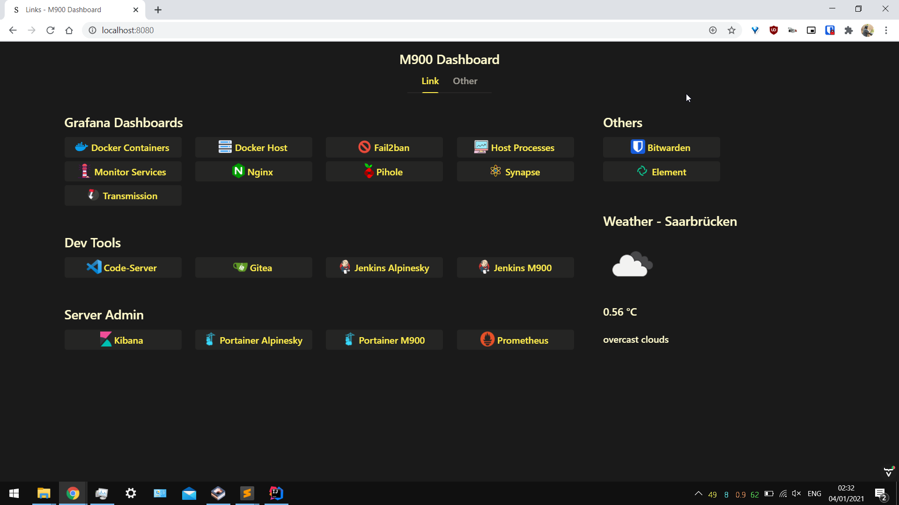
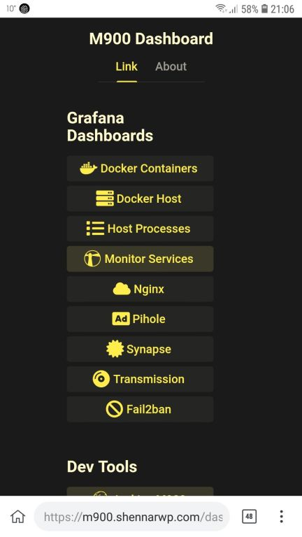

# dashboard

This is the source code of my personal dashboard,
written in Java using [Vaadin](https://vaadin.com/) and [SpringBoot](https://spring.io/projects/spring-boot).

The site can be seen [here](https://m900.shennarwp.com/dashboard/).

Current progress:

 